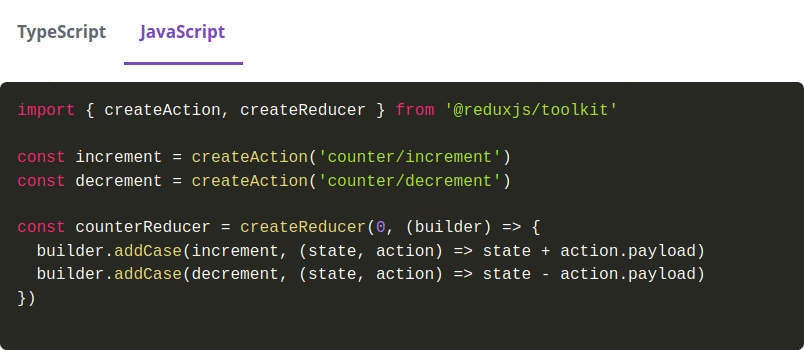
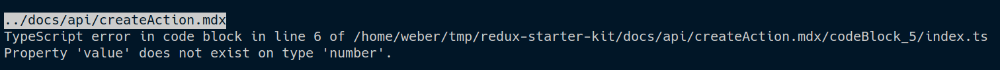

# remark-typescript-tools

## What is it?

`remark-typescript-tools` contains two remark plugins to use TypeScript code with remark, to generate better documentation.

Currently it is aimed at docusaurus, but already pretty configurable. And it's open source, pull requests for more configuration options are always welcome ;)

### transpileCodeblocks

The `transpileCodeblocks` plugin will transpile all your `ts`-typed codeblocks to JavaScript and displays them side-by-side in tabs.

So

````md
```ts
import { createAction, createReducer } from '@reduxjs/toolkit';

const increment = createAction<number>('counter/increment');
const decrement = createAction<number>('counter/decrement');

const counterReducer = createReducer(0, (builder) => {
  builder.addCase(increment, (state, action) => state + action.payload);
  builder.addCase(decrement, (state, action) => state - action.payload);
});
```
````

will be rendered to this:



It will _validate the TypeScript on compilation_, so your docs will be guaranteed to actually be runnable.
It can even work _against your library source code_, which means that any PR that requires an update to your documentation will already get noticed in CI.



Also, your examples can contain virtual files, importing from each other and you can even hide some of these virtual files, if they are not relevant for the example, but necessary for you to have valid code.

````md
```ts
// file: reducers.ts noEmit
import { Reducer } from '@reduxjs/toolkit';
declare const rootReducer: Reducer<{}>;
export default rootReducer;

// file: store.ts
import { configureStore } from '@reduxjs/toolkit';

import rootReducer from './reducers';

const store = configureStore({ reducer: rootReducer });
```
````

### linkDocblocks

This plugin allows you to link to sections of your source code's Docblocks, making sure that your documentation is up-to-date with your code.

So assuming this source code:

````ts
/**
 * Interface Test!
 * @remarks
 * Some more infos.
 */
export interface Test {
  /**
     * This is a function
     * @remarks
     * And it is nested!
     * @overloadSummary
     * Also, this is a special overload
     * @overloadRemarks
     * With some more description
     * @param foo - some info about the first parameter
     * @example
```ts
console.log("test")
```
     */
  nestedFunction(foo: string): void;
  /**
     * This is a function
     * @remarks
     * And it is nested!
     * @overloadSummary
     * Also, this is a special overload that takes a second parameter
     * @overloadRemarks
     * With some more extra description
     * @param foo - some info about the first parameter
     * @param bar - and some info about the second parameter
     * @example
```ts
console.log("test")
```
     */
  nestedFunction(foo: string, bar: number): void;
}
````

the markdown code

```md
# Infos about Test

[summary](docblock://test/linkDocblocks.test.ts?token=Test)

## Some more remarks

[remarks](docblock://test/linkDocblocks.test.ts?token=Test)
```

would result in

```md
# Infos about Test

Interface Test!

## Some more remarks

Some more infos.
```

And you can also link to nested identifiers or function overloads:

```md
# Infos about Test.nestedFunction

[summary,remarks](docblock://test/linkDocblocks.test.ts?token=Test.nestedFunction)

# Overload 0

[overloadSummary,params,overloadRemarks,examples](docblock://test/linkDocblocks.test.ts?token=Test.nestedFunction&overload=0)

# Overload 1

[overloadSummary,params,overloadRemarks,examples](docblock://test/linkDocblocks.test.ts?token=Test.nestedFunction&overload=1)
```

will result in

```md
# Infos about Test.nestedFunction

This is a function

And it is nested!

# Overload 0

Also, this is a special overload

#### Parameters:

- **foo** some info about the first parameter

With some more description

\`\`\`ts
console.log(\\"test\\")

\`\`\`

# Overload 1

Also, this is a special overload that takes a second parameter

#### Parameters:

- **foo** some info about the first parameter
- **bar** and some info about the second parameter

With some more extra description

\`\`\`ts
console.log(\\"test\\")

\`\`\`
```

Of course, you can combine this with `transpileCodeblocks`, so your examples from your comments from your source code will be actually type-checked against your source code!

## Usage with Docusaurus:

We are using the plugins like this over in `reduxjs/toolkit`:

```js
// site configuration options.
const { resolve } = require('path');
const {
  linkDocblocks,
  transpileCodeblocks,
} = require('remark-typescript-tools');

module.exports = {
  presets: [
    [
      '@docusaurus/preset-classic',
      {
        docs: {
          remarkPlugins: [
            [
              linkDocblocks,
              {
                extractorSettings: {
                  tsconfig: resolve(__dirname, '../docs/tsconfig.json'),
                  basedir: resolve(__dirname, '../src'),
                  rootFiles: ['index.ts'],
                },
              },
            ],
            [
              transpileCodeblocks,
              {
                compilerSettings: {
                  tsconfig: resolve(__dirname, '../docs/tsconfig.json'),
                  externalResolutions: {
                    '@reduxjs/toolkit': {
                      resolvedPath: resolve(__dirname, '../src'),
                      packageId: {
                        name: '@reduxjs/toolkit',
                        subModuleName: 'index.ts',
                        version: '1.0',
                      },
                    },
                  },
                },
              },
            ],
          ],
        },
      },
    ],
  ],
};
```

In addition to that, `transpileCodeblocks` takes these options:

```ts
import type { Node } from 'unist';
import type { VFile } from 'vfile';

export interface TranspileCodeblocksSettings {
  compilerSettings: CompilerSettings;
  postProcessTranspiledJs?: PostProcessor;
  postProcessTs?: PostProcessor;
  assembleReplacementNodes?: (
    node: CodeNode,
    file: VFile,
    virtualFolder: string,
    virtualFiles: Record<string, VirtualFile>,
    transpilationResult: Record<string, TranspiledFile>,
    postProcessTs: PostProcessor,
    postProcessTranspiledJs: PostProcessor
  ) => Node[];
}

interface CompilerSettings {
  tsconfig: string;
  externalResolutions: Record<string, ExternalResolution>;
  /**
   * Allows transforming the virtual filepath for codeblocks.
   * This allows the files to resolve node modules from a different location
   * to their own directory.
   */
  transformVirtualFilepath?: (filepath: string) => string;
}

interface CodeNode extends Node {
  lang: string;
  meta: string;
  value: string;
  indent: number[];
}

export interface VirtualFile {
  code: string;
  skip?: boolean;
}

export type VirtualFiles = Record<string, VirtualFile>;

type PostProcessor = (
  files: VirtualFiles,
  parentFile?: string,
  defaultProcessor?: PostProcessor
) => VirtualFiles;

export interface TranspiledFile extends VirtualFile {
  diagnostics: Array<Diagnostic>;
}

export type TranspiledFiles = Record<string, TranspiledFile>;
```
